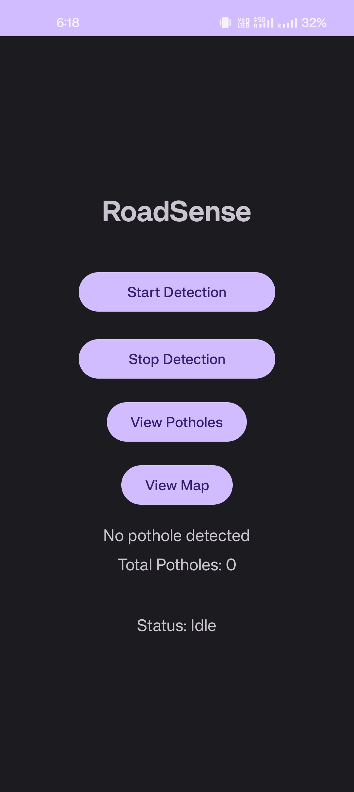
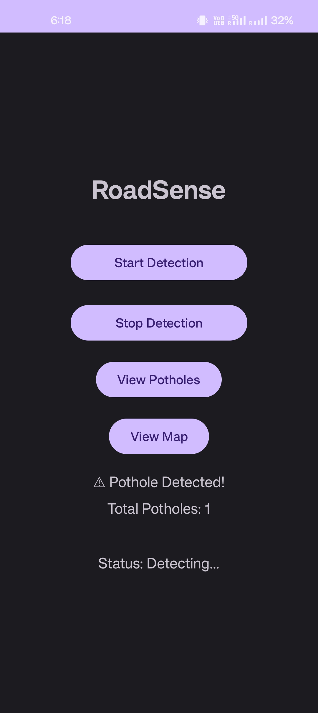
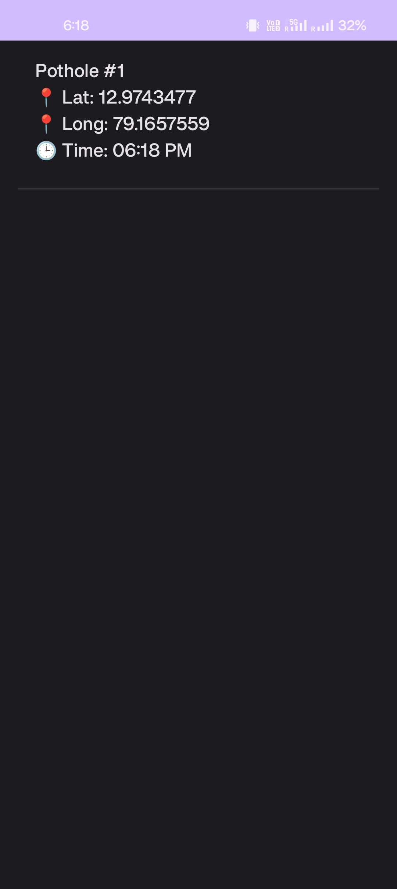
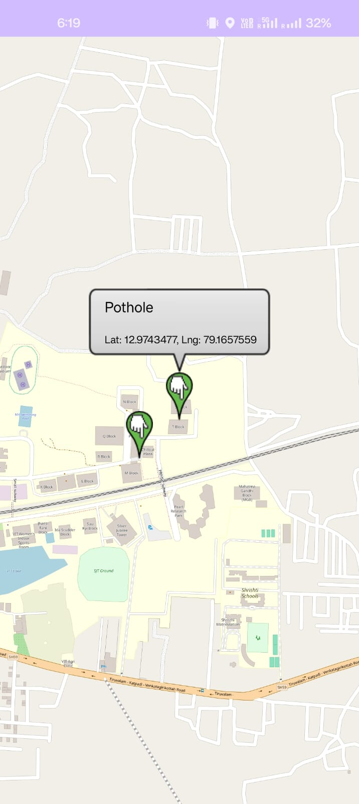

# RoadSense

### Intelligent Road Anomaly Detection System

RoadSense is an Android-based road anomaly detection system designed to identify potential potholes and road irregularities using smartphone sensors. The application analyzes motion data collected from the device and uses a speed-adaptive detection threshold to identify significant road anomalies.

When an anomaly is detected, RoadSense records the event along with its geographic location, allowing detected potholes to be viewed within the application.

---

## Features

- **Pothole Detection** — Detects potential road anomalies using smartphone motion sensors.
- **Speed-Adaptive Detection** — Dynamically adjusts the detection threshold according to the vehicle's speed.
- **Real-Time Sensor Monitoring** — Continuously analyzes sensor data while traveling.
- **Location Tracking** — Associates detected anomalies with their geographic coordinates.
- **Map Visualization** — Displays detected pothole locations on a map.
- **Pothole History** — Maintains a list of detected potholes with their location and detection time.

---

## How It Works

```text
Smartphone Sensors
        ↓
Motion / Acceleration Data
        ↓
Speed-Based Thresholding
        ↓
Anomaly Detection
        ↓
Pothole Detected
        ↓
GPS Location + Timestamp
        ↓
Pothole Record
        ↓
 ┌───────────────┐
 ↓               ↓
Pothole List   Map View
```
RoadSense monitors motion data from the smartphone while the detection service is active. Sensor readings are evaluated against a detection threshold that adapts according to the current speed.

When the measured motion satisfies the detection conditions, RoadSense records the event along with its location and timestamp.

Application Architecture
```text
                         RoadSense
                            │
             ┌──────────────┼──────────────┐
             │              │              │
             ▼              ▼              ▼
       Detection         Main UI      Visualization
        Service             │          & Management
             │              │              │
             ▼              ▼        ┌─────┴─────┐
       Sensor Data      Application   ▼           ▼
       Processing          Flow      Map       Pothole
                                      View        List
                                         
                            │
                            ▼
                    Pothole Repository
```
Main Components
| Component                | Responsibility                              |
| ------------------------ | ------------------------------------------- |
| `MainActivity.kt`        | Main application interface                  |
| `DetectionService.kt`    | Handles sensor-based road anomaly detection |
| `MapActivity.kt`         | Displays detected pothole locations         |
| `PotholeListActivity.kt` | Displays detected potholes                  |
| `Pothole.kt`             | Represents a pothole detection record       |
| `PotholeRepository.kt`   | Manages pothole data                        |


Detection Approach

RoadSense uses smartphone motion sensors to identify sudden changes associated with road irregularities.

A fixed threshold may not work equally well at different driving speeds. RoadSense therefore incorporates speed-dependent thresholding, allowing the detection criteria to adapt according to the current speed.

The detection process is:
```text
Sensor Reading
      ↓
Acceleration Analysis
      ↓
Current Speed
      ↓
Dynamic Detection Threshold
      ↓
Compare Sensor Value
      ↓
 ┌───────────────┐
 │               │
Normal        Anomaly
 │               │
 ↓               ↓
Continue     Record Event
Monitoring
```

Technology Stack:

Development:
Kotlin
Android
Android Studio

Android Technologies:
Android Sensors
Location Services
Android Activities
Background Detection Service
XML Layouts

Mapping:
Google Maps / Android Maps integration

Build System:
Gradle
Kotlin DSL

## Screenshots

### Main Dashboard

The RoadSense dashboard allows users to start and stop detection, view detected potholes, and access the map.



### Real-Time Pothole Detection

The application displays the detection status and updates the total number of detected potholes when an anomaly is identified.



### Pothole History

Detected potholes are recorded with their geographic coordinates and detection timestamp.



### Pothole Map

Detected potholes can be visualized geographically on the map.




Project Structure:
```text
RoadSense/
│
├── app/
│   └── src/
│       ├── main/
│       │   ├── java/
│       │   │   ├── MapActivity.kt
│       │   │   ├── Pothole.kt
│       │   │   ├── PotholeRepository.kt
│       │   │   └── com/keshav/roadsense/
│       │   │       ├── DetectionService.kt
│       │   │       ├── MainActivity.kt
│       │   │       └── PotholeListActivity.kt
│       │   │
│       │   ├── res/
│       │   └── AndroidManifest.xml
│       │
│       └── test/
│
├── gradle/
├── build.gradle.kts
├── gradle.properties
├── gradlew
├── gradlew.bat
├── settings.gradle.kts
├── .gitignore
└── README.md
```

Getting Started
Prerequisites
Android Studio
Android SDK
Android device or Android emulator
Device with motion and location sensors
Installation

Clone the repository:
git clone https://github.com/kohlikeshav890/RoadSense.git

Open the project in Android Studio and allow Gradle to synchronize.

Connect an Android device or start an emulator, then build and run the application.

For map functionality, configure the required Google Maps/location configuration according to the Android project setup.

Future Improvements:
Machine-learning-based road anomaly classification
Improved false-positive filtering
More advanced sensor-data preprocessing
Cloud-based storage of detected road anomalies
Crowdsourced road-condition mapping
Pothole severity classification
Route-based road-condition analysis
Historical road-condition analytics
Improved road anomaly visualization

Author

Keshav Kohli

B.Tech Information Technology
VIT Vellore

License:
This project is intended for educational and academic purposes.
